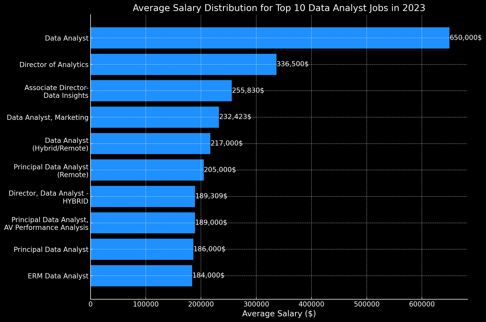
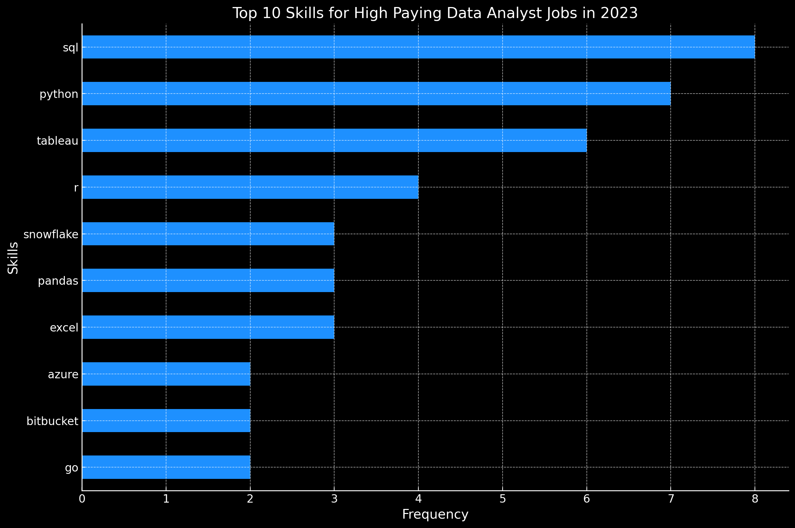

# Introduction
Welcome to our project where we dive into data analyst jobs in 2023 📊. We uncover the highest-paying jobs 💰, the most sought-after skills 🔍, and where great pay meets plenty of job opportunities 🤝. Our aim is to guide job seekers and employers through the current trends in the data analytics field 🌐. This insight is perfect for anyone looking to advance in data or aiming to recruit top talent.

SQL queries ? Check them out here: [project_sql folder](/project_sql/)
# Background
The data analytics job market has grown rapidly, driven by businesses' need to make sense of large amounts of data. In 2023, this field is more important than ever, with a high demand for skilled analysts who can turn data into insights. Our project focuses on identifying the highest-paying roles, essential skills, and the sweet spots of demand and compensation in data analytics. This effort aims to guide both job seekers and employers through the evolving landscape of the data analytics profession.
### What Questions i want to answer during my SQL queries were:
1. What are the top paying data analyst jobs?
2. What skills are required for these top-paying jobs?
3. Which skills are the most associated with higher salaries?
4. Which skills are associated with higher salaries?
5. What are the most optimal skills to learn?

# Tools I used
For my data analysis project, I used a few tools to help me with different parts of my work:

- **SQL:** To find and organize the data I needed.
- **PostgreSQL:** This is where I kept all my data safe and sound.
- **Visual Studio Code:** This was like my digital notebook where I wrote and fixed my project code.
- **Git & GitHub:** Used together for version control, allowing me to track changes in my project code and collaborate with others online.
# The Analysis
Each query fot this project aimed at investigating specific aspects of the data analysis job market. Here's how I approached each question:

### 1. Top Paying Data Analyst jobs
To identify the highest-paying roles, I filtered data analyst positions by average yearly salary and location, focusing on remote jobs. Tihs query highlights the high paying opportunities in the field.

```sql
SELECT
    job_postings_fact.job_id,
    company_dim.name AS company_name,
    job_postings_fact.job_title,
    job_postings_fact.job_location,
    job_postings_fact.job_schedule_type,
    job_postings_fact.salary_year_avg,
    job_postings_fact.job_posted_date
FROM
    job_postings_fact
LEFT JOIN company_dim ON
    job_postings_fact.company_id = company_dim.company_id
WHERE
    job_postings_fact.salary_year_avg IS NOT NULL AND job_postings_fact.job_title_short = 'Data Analyst' AND job_location = 'Anywhere'

ORDER BY
    job_postings_fact.salary_year_avg DESC
LIMIT 10
```


Overview of Leading Data Analyst Positions in 2023:

1. **Extensive Salary Scale:** The highest-paying positions for data analysts range between $184,000 and $650,000, highlighting the substantial earning possibilities within the sector.
2. **Variety of Hiring Companies:** Firms such as SmartAsset, Meta, and AT&T, known for their competitive pay packages, represent a wide range of sectors showing keen interest in data analytics talent.
3. **Diversity in Job Roles:** The field features a broad spectrum of titles, from Data Analyst to Director of Analytics, indicating the diverse opportunities and areas of expertise available in data analytics.



*Bar graph visualizing the salary for the top 10 salaries for data analysts; ChatGPT generated this graph from my SQL query results*

### 2. Skills for Top Paying Jobs
To find out what skills are needed for the best-paying jobs, I combined information from job ads with skills data. This helps us see what skills employers look for in jobs that pay well.

```sql
WITH top_10_paying_jobs AS 
    (
    SELECT
        job_postings_fact.job_id,
        company_dim.name AS company_name,
        job_postings_fact.job_title,
        job_postings_fact.salary_year_avg
    FROM
        job_postings_fact
    LEFT JOIN company_dim ON
        job_postings_fact.company_id = company_dim.company_id
    WHERE
        job_postings_fact.salary_year_avg IS NOT NULL AND job_postings_fact.job_title_short = 'Data Analyst' AND job_location = 'Anywhere'

    ORDER BY
        job_postings_fact.salary_year_avg DESC
    LIMIT 10
    )

SELECT
    top_10_paying_jobs.*,
    skills

FROM
    top_10_paying_jobs
INNER JOIN
    skills_job_dim ON 
    top_10_paying_jobs.job_id = skills_job_dim.job_id
INNER JOIN
    skills_dim ON
    skills_job_dim.skill_id = skills_dim.skill_id
ORDER BY
    salary_year_avg DESC
```
Here's a simple summary of the most needed skills for the top 10 highest-paying data analyst jobs in 2023:

- **SQL** is the most popular, mentioned in **8** jobs.
- **Python** is just behind, found in **7** jobs.
- **Tableau** is in demand too, listed in **6** jobs. Skills like **R**, **Snowflake**, **Pandas**, and **Excel** are also wanted, but less so.


*Bar graph visualizing the count of skills for the top 10 paying jobs for data analysts; ChatGPT generated this graph from my SQL query results*


### 3. In Demand Skills for Data Analyst

This query helped identify the skills most frequently requested in job postings, directing focus to areas with high demand.

```sql
SELECT 
    skills,
    COUNT(*) AS skill_count
FROM job_postings_fact
INNER JOIN
    skills_job_dim ON 
   job_postings_fact.job_id = skills_job_dim.job_id
INNER JOIN
    skills_dim ON
    skills_job_dim.skill_id = skills_dim.skill_id
WHERE
    job_title_short = 'Data Analyst' AND job_work_from_home = TRUE
GROUP BY
    skills
ORDER BY
    skill_count DESC
LIMIT 5
```
For data analysts in 2023, the most sought-after skills are:

SQL and Excel are key, highlighting the importance of basic data management and spreadsheet skills.
Programming and visualization tools such as Python, Tableau, and Power BI are crucial, showing a growing need for technical abilities in presenting data and aiding decisions.


| skills   | skill_count |
|----------|-------------|
| sql      | 7291        |
| excel    | 4611        |
| python   | 4330        |
| tableau  | 3745        |
| power bi | 2609        |

*Table of the demand for the top 5 skills in data analyst job postings*

## 4. Skills Based on Salary
Exploring the average salaries associated with different skills revealed which skills are the highest paying.

```sql
SELECT 
    skills,
    ROUND(AVG(job_postings_fact.salary_year_avg),2) AS average_salary
FROM job_postings_fact
INNER JOIN
    skills_job_dim ON 
   job_postings_fact.job_id = skills_job_dim.job_id
INNER JOIN
    skills_dim ON
    skills_job_dim.skill_id = skills_dim.skill_id
WHERE
    job_title_short = 'Data Analyst' AND salary_year_avg IS NOT NULL
GROUP BY
    skills
ORDER BY
    average_salary DESC
LIMIT 25
```
Here's a simplified summary of the most valuable skills for Data Analysts:

- **Big Data and Machine Learning Skills**: High salaries go to analysts who are good with big data technologies (like PySpark, Couchbase), machine learning tools (like DataRobot, Jupyter), and Python libraries (like Pandas, NumPy). This shows how much the industry values the ability to process data and make predictions.
  
- **Software Development & Deployment Know-How**: Being skilled in development and deployment tools (like GitLab, Kubernetes, Airflow) merges data analysis with engineering. It highlights the value of being able to automate processes and manage data pipelines efficiently.
  
- **Cloud Computing Knowledge**: Understanding cloud and data engineering tools (like Elasticsearch, Databricks, GCP) is increasingly important. It indicates that knowing how to use cloud-based analytics can greatly increase what data analysts earn.


| Skills         | Average Salary |
|----------------|----------------|
| pyspark        | 208172         |
| bitbucket      | 189155         |
| watson         | 160515         |
| couchbase      | 160515         |
| datarobot      | 155486         |
| gitlab         | 154500         |
| swift          | 153750         |
| jupyter        | 152777         |
| pandas         | 151821         |
| elasticsearch  | 145000         |

*Table of the average salary for the top 10 paying skills for data analysts*

### 5. Most Optimal Skills to Learn
This query used information about what skills are wanted and how much they pay. It aimed to find skills that are both needed a lot and pay well, helping to choose which skills to learn.

```sql
SELECT
    skills_dim.skill_id,
    skills_dim.skills,
    COUNT(skills_job_dim.job_id) AS demand_count,
    ROUND(AVG(job_postings_fact.salary_year_avg),0) AS avg_salary
FROM
    job_postings_fact
INNER JOIN
    skills_job_dim ON job_postings_fact.job_id = skills_job_dim.job_id
INNER JOIN
    skills_dim ON skills_job_dim.skill_id = skills_dim.skill_id
WHERE
    job_title_short = 'Data Analyst'
    AND salary_year_avg IS NOT NULL
    AND job_work_from_home = TRUE
GROUP BY
    skills_dim.skill_id
HAVING 
    COUNT(skills_job_dim.job_id) > 10 
ORDER BY 
    
  
    COUNT(skills_job_dim.job_id) DESC  ,avg_salary DESC
LIMIT 25
```

| Skill ID | Skills     | Demand Count | Average Salary |
|----------|------------|--------------|----------------|
| 8        | go         | 27           | 115320         |
| 234      | confluence | 11           | 114210         |
| 97       | hadoop     | 22           | 113193         |
| 80       | snowflake  | 37           | 112948         |
| 74       | azure      | 34           | 111225         |
| 77       | bigquery   | 13           | 109654         |
| 76       | aws        | 32           | 108317         |
| 4        | java       | 17           | 106906         |
| 194      | ssis       | 12           | 106683         |
| 233      | jira       | 20           | 104918         |
*Table of the most optimal skills for data analyst sorted by salary*

Here's a simplified summary of the best skills for Data Analysts in 2023:

- **Programming Languages**: Python and R are very popular, with demand counts of 236 and 148. Their average salaries are about $101,397 for Python and $100,499 for R. This shows that being good at these languages is important and common.
  
- **Cloud Tools and Technologies**: Knowing how to use Snowflake, Azure, AWS, and BigQuery is in big demand and pays well. This shows how important cloud platforms and big data technologies are in data analysis.
  
- **Business Intelligence and Visualization Tools**: Tableau and Looker are also in high demand, with 230 and 49 demand counts, and average salaries of about $99,288 and $103,795. This points out the importance of turning data into insights you can act on.
  
- **Database Technologies**: Being skilled in databases like Oracle, SQL Server, and NoSQL is needed, with salaries between $97,786 and $104,534. This shows the ongoing need for managing data storage and retrieval.

# What I Learned

During this journey, I've significantly upgraded my SQL skills:

- **Complex Query Crafting**: I've become an expert at advanced SQL, skillfully joining tables and using WITH clauses to handle temporary tables like a master.
- **Data Aggregation**: I've mastered using GROUP BY and made aggregate functions such as COUNT() and AVG() my go-to tools for summarizing data.
- **Analytical Wizardry**: I've improved my ability to solve real-world problems, transforming questions into insightful, actionable SQL queries.
# Conclusion

### Insights

The analysis unveiled several key insights:

1. **Top-Paying Data Analyst Jobs**: Remote work for data analysts spans a broad salary range, peaking at $650,000! This highlights the lucrative potential in the field.
2. **Skills for Top-Paying Jobs**: Advanced SQL proficiency is a must for securing high-paying data analyst roles, underscoring its importance for top earners.
3. **Most In-Demand Skills**: SQL stands out as the most sought-after skill among data analysts, essential for those seeking employment.
4. **Skills with Higher Salaries**: Niche skills like SVN and Solidity fetch the highest average salaries, showing the value of specialized knowledge.
5. **Optimal Skills for Job Market Value**: SQL's high demand and salary prospects make it a strategic skill for data analysts aiming to enhance their market value.

### Closing Thoughts

This project not only honed my SQL capabilities but also provided a deep dive into the data analyst job market. The insights gained offer a roadmap for skill prioritization and job-seeking strategies. By concentrating on in-demand, well-paid skills, aspiring data analysts can navigate the competitive job market more effectively. This journey underscores the significance of continual learning and adapting to new trends in data analytics.